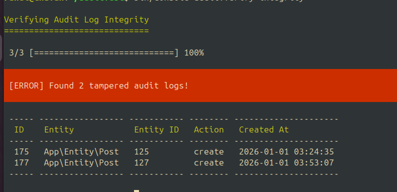

# AuditTrailBundle

[](https://github.com/rcsofttech85/AuditTrailBundle/actions/workflows/ci.yaml)
[](https://packagist.org/packages/rcsofttech/audit-trail-bundle)

[](https://packagist.org/packages/rcsofttech/audit-trail-bundle)
[](https://app.codacy.com/gh/rcsofttech85/AuditTrailBundle/dashboard?utm_source=gh&utm_medium=referral&utm_content=&utm_campaign=Badge_grade)
[](https://app.codacy.com/gh/rcsofttech85/AuditTrailBundle/dashboard?utm_source=gh&utm_medium=referral&utm_content=&utm_campaign=Badge_coverage)
[](https://dashboard.stryker-mutator.io/reports/github.com/rcsofttech85/AuditTrailBundle/main)

**Enterprise-grade, high-performance audit trail solution for Symfony.**

AuditTrailBundle is a modern, lightweight bundle that automatically tracks and stores Doctrine ORM entity changes. Built for performance and compliance, it uses a unique **Split-Phase Architecture** to ensure your application stays fast even under heavy load.

---

## Key Features

- **High Performance**: Non-blocking audits using a **Split-Phase Architecture** (capture in `onFlush`, dispatch in `postFlush`).
- **Multiple Transports**:
  - **Doctrine**: Store logs in your local database (default).
  - **HTTP**: Stream logs to external APIs (ELK, Splunk, etc.).
  - **Queue**: Offload processing to **Symfony Messenger** (RabbitMQ, Redis).
- **Deep Collection Tracking**: Tracks Many-to-Many and One-to-Many changes with precision (logs exact IDs).
- **Sensitive Data Masking**: Native support for `#[SensitiveParameter]` and custom `#[Sensitive]` attributes for **GDPR compliance**.
- **Safe Revert Support**: Easily roll back entities to any point in history, including associations.
- **Conditional Auditing**: Skip logs based on runtime conditions using **Symfony ExpressionLanguage** or custom voters.
- **Rich Context Tracking**: Automatically track **Impersonation** and store arbitrary metadata in a JSON `context` column.
- **Modern Stack**: Built for **PHP 8.4+**, **Symfony 7.4+**, and **Doctrine ORM 3.0+**.

---

## Why AuditTrailBundle?

Most Symfony audit solutions either:

- Slow down Doctrine flush operations
- Log incomplete transactional data
- Cannot safely revert changes
- Are hard to extend beyond database storage

AuditTrailBundle is designed for **production-grade auditing** with:

- **Minimal write overhead**: Split-phase architecture ensures your app stays fast.
- **Transaction-aware logging**: Group related changes under a single transaction hash.
- **Safe revert support**: Easily roll back entities to any point in history, including associations.
- **Multiple transport strategies**: Store logs in DB, send to an API, or offload to a Queue (Messenger).

---

## Architecture

This bundle is built using a **Split-Phase Audit Architecture** to ensure high performance and reliability in Symfony applications.

1. **Phase 1 (Capture)**: Listens to Doctrine `onFlush` to capture changes without slowing down the transaction.
2. **Phase 2 (Dispatch)**: Dispatches audits in `postFlush` via your chosen transport.

For a deep dive into the design decisions and how the split-phase approach works, check out the full article on Medium:
[Designing a Split-Phase Audit Architecture for Symfony](https://medium.com/@rcsofttech85/designing-a-split-phase-audit-architecture-for-symfony-f4ff532491dc)

---

## Quick Start

### 1. Installation

```bash
composer require rcsofttech/audit-trail-bundle
```

### 2. Database Setup (Doctrine Transport)

If you are using the **Doctrine Transport** (default), update your database schema:

```bash
php bin/console make:migration
php bin/console doctrine:migrations:migrate
```

### 3. Basic Usage

Add the `#[Auditable]` attribute to any Doctrine entity you want to track.

```php
use Rcsofttech\AuditTrailBundle\Attribute\Auditable;

#[ORM\Entity]
#[Auditable(ignoredProperties: ['internalCode'])]
class Product
{
    #[ORM\Id, ORM\GeneratedValue, ORM\Column]
    private ?int $id = null;

    #[ORM\Column]
    private string $name;

    #[ORM\Column]
    private ?string $internalCode = null;
}
```

---

## Configuration

Create a configuration file at `config/packages/audit_trail.yaml`.

For detailed transport configuration and usage, see  
[audit-transports](/docs/symfony-audit-transports.md).

```yaml
audit_trail:
    # Enable or disable the bundle globally
    enabled: true

    # Global list of properties to ignore (e.g., timestamps)
    ignored_properties: ['updatedAt', 'updated_at', 'password', 'token']

    # Global list of entities to ignore
    ignored_entities: []

    # Retention period for database logs (in days)
    retention_days: 365

    # Context tracking
    track_ip_address: true
    track_user_agent: true

    # enable or disable delete tracking
    enable_hard_delete: true
    enable_soft_delete: true
    soft_delete_field: 'deletedAt'

    transports:
        # Store logs in the local database
        doctrine: true

        # Send logs to an external API
        http:
            enabled: false
            endpoint: 'https://audit-service.internal/api/logs'

        # Dispatch logs to a message queue
        queue:
            enabled: false
            bus: 'messenger.bus.default' # Optional: specify a custom bus
            
    # Integrity & Signing
    # -------------------
    # Enable cryptographic signing of audit logs to prevent tampering.
    integrity:
        enabled: true
        secret: '%env(AUDIT_INTEGRITY_SECRET)%'
        algorithm: 'sha256'

    # Transaction Safety & Performance
    # --------------------------------
    # true (Default): Audits are sent AFTER the transaction commits (postFlush).
    #   - Pros: High performance, non-blocking. Main transaction succeeds even if audit fails.
    #   - Cons: Small risk of "data without audit" if app crashes between commit and audit.
    #   - Recommended for: External transports (HTTP, Queue).
    #
    # false: Audits are sent DURING the transaction (onFlush).
    #   - Pros: Strict atomicity. Data and audit are committed together.
    #   - Cons: Slower. If audit transport fails, the entire transaction rolls back.
    #   - Recommended for: Doctrine transport (when strict compliance is required).
    defer_transport_until_commit: true

    # If true, an exception in the transport will stop execution (and rollback if defer=false).
    # If false (default), transport errors are logged but execution continues.
    fail_on_transport_error: false
```

---

## Detailed Usage

### 1. Granular Control

You can ignore specific properties or enable/disable auditing per entity via the class-level attribute.

```php
#[Auditable(enabled: true, ignoredProperties: ['internalCode'])]
class Product
{
    private ?string $internalCode = null;
}
```

### 2. Masking Sensitive Fields

Sensitive data is automatically masked in audit logs.

**Option 1: Use PHP's `#[SensitiveParameter]`**

```php
public function __construct(
    #[\SensitiveParameter] private string $password,
) {}
```

**Option 2: Use `#[Sensitive]`**

```php
use Rcsofttech\AuditTrailBundle\Attribute\Sensitive;

#[Sensitive(mask: '****')]
private string $ssn;
```

### 3. Conditional Auditing

Skip auditing based on runtime conditions using the `#[AuditCondition]` attribute or custom voters.

#### Option 1: Using ExpressionLanguage

Add the `#[AuditCondition]` attribute to your entity. You have access to `object`, `action`, `changeSet`, and `user`.

```php
use Rcsofttech\AuditTrailBundle\Attribute\AuditCondition;
use Rcsofttech\AuditTrailBundle\Attribute\Auditable;

#[Auditable]
#[AuditCondition("action == 'update' and object.getPrice() > 100")]
class Product
{
    public function getPrice(): int { ... }
}
```

**Available Context Variables:**

- `object`: The entity being audited.
- `action`: The action being performed (`create`, `update`, `delete`, etc.).
- `changeSet`: The array of changes.
- `user`: An object containing `id`, `username`, and `ip`.

#### Option 2: Custom Voters

For complex logic, implement the `AuditVoterInterface`. Your voter will be automatically discovered if it's registered as a service.

```php
use Rcsofttech\AuditTrailBundle\Contract\AuditVoterInterface;

class MyCustomVoter implements AuditVoterInterface
{
    public function vote(object $entity, string $action, array $changeSet): bool
    {
        // Return false to skip auditing
        return $action !== 'delete' || $this->isAdmin();
    }
}
```

### 4. Rich Context & Impersonation Tracking

The bundle automatically tracks rich context for every audit log, stored in a flexible JSON `context` column.

#### Impersonation Tracking

If an admin is impersonating a user (using Symfony's `_switch_user`), the bundle automatically records the impersonator's ID and username in the audit log context.

```php
$entry = $auditReader->forEntity(Product::class, '123')->getFirstResult();
$context = $entry->getContext();

if (isset($context['impersonation'])) {
    echo "Action performed by " . $context['impersonation']['impersonator_username'];
}
```

#### Custom Context

You can manually add custom metadata to your audit logs by implementing the `AuditContextContributorInterface`. This is the recommended way to add application-specific information like correlation IDs, app versions, or feature flags.

```php
namespace App\Audit;

use Rcsofttech\AuditTrailBundle\Contract\AuditContextContributorInterface;

class SystemInfoContributor implements AuditContextContributorInterface
{
    public function contribute(object $entity, string $action, array $changeSet): array
    {
        return [
            'app_version' => 'v2.4.1',
            'server_node' => gethostname(),
        ];
    }
}
```

The bundle automatically discovers and executes all tagged contributors, merging their results into the `context` JSON column.

### 5. Events & Customization

The bundle dispatches Symfony events that allow you to hook into the audit process.

#### `AuditLogCreatedEvent`

Dispatched immediately after an `AuditLog` object is created but before it is persisted or sent to a transport. Use this to:

- Add custom metadata to the `context`.
- Modify the audit log data.
- Trigger external notifications.

```php
namespace App\EventSubscriber;

use Rcsofttech\AuditTrailBundle\Event\AuditLogCreatedEvent;
use Symfony\Component\EventDispatcher\EventSubscriberInterface;

class AuditSubscriber implements EventSubscriberInterface
{
    public static function getSubscribedEvents(): array
    {
        return [
            AuditLogCreatedEvent::NAME => 'onAuditLogCreated',
        ];
    }

    public function onAuditLogCreated(AuditLogCreatedEvent $event): void
    {
        $log = $event->getAuditLog();
        
        // Add custom metadata
        $context = $log->getContext();
        $context['server_id'] = 'node-01';
    }
}
```

#### `AuditMessageStampEvent`

Dispatched when an audit message is about to be sent via the Messenger transport. Use this to add custom stamps (e.g., `DelayStamp`, `AmqpStamp`) to the message.

```php
namespace App\EventSubscriber;

use Rcsofttech\AuditTrailBundle\Event\AuditMessageStampEvent;
use Symfony\Component\EventDispatcher\EventSubscriberInterface;
use Symfony\Component\Messenger\Stamp\DelayStamp;

class AuditStampSubscriber implements EventSubscriberInterface
{
    public static function getSubscribedEvents(): array
    {
        return [
            AuditMessageStampEvent::class => 'onAuditMessageStamp',
        ];
    }

    public function onAuditMessageStamp(AuditMessageStampEvent $event): void
    {
        // Add a 5-second delay to all audit messages
        $event->addStamp(new DelayStamp(5000));
    }
}
```

### 6. Programmatic Audit Retrieval (Reader / Query API)

Read and query audit logs programmatically using a dedicated, read-only API.

→ [Audit Reader Documentation (Symfony & Doctrine)](docs/symfony-audit-reader.md)

---

## CLI Commands

The bundle provides several commands for managing audit logs.

### List Audit Logs

```bash
php bin/console audit:list --entity=User --action=update --limit=50
```

### Purge Old Logs

```bash
php bin/console audit:purge --before="30 days ago" --force
```

### Export Logs

```bash
php bin/console audit:export --format=json --output=audits.json
```

### View Diff

```bash
php bin/console audit:diff User 42
```

### Revert Entity Changes

AuditTrailBundle provides a powerful **Point-in-Time Restore** capability, allowing you to undo accidental changes or recover data from any point in your audit history.

```bash
# Revert an entity to its state in a specific audit log
php bin/console audit:revert 123

# Revert with custom context (JSON)
php bin/console audit:revert 123 --context='{"reason": "Accidental deletion", "ticket": "T-101"}'
```

#### Custom Context on Revert

You can pass custom context when programmatically reverting an entity. This is useful for tracking why a revert was performed.

```php
$auditReverter->revert($log, false, false, [
    'reason' => 'Accidental deletion',
    'ticket_id' => 'TICKET-456'
]);
```

The bundle also **automatically** adds `reverted_log_id` to the context of the new audit log, linking it back to the original entry.

**Why it's "Safe":**

- **Association Awareness**: Automatically handles entity relations and collections.
- **Soft-Delete Support**: Temporarily restores soft-deleted entities to apply the revert.
- **Dry Run Mode**: Preview exactly what will change before applying (`--dry-run`).
- **Data Integrity**: Ensures the entity remains in a valid state after the rollback.

> [!TIP]
> Use the revert feature for **emergency data recovery**, **undoing unauthorized changes**, or **restoring accidental deletions** with full confidence.

### Verify Audit Log Integrity

Ensure the integrity of your audit logs by detecting any unauthorized tampering or modifications. This command validates cryptographic hashes to identify compromised records.

```bash
php bin/console audit:verify-integrity
```

**Use Cases:**

- **Compliance Audits**: Verify that audit logs haven't been altered for regulatory compliance (SOX, HIPAA, GDPR).
- **Security Monitoring**: Detect unauthorized tampering after security incidents.
- **Historical Data Verification**: Confirm past records are accurate and trustworthy.

**Example Output:**



> [!WARNING]
> Any tampered logs indicate a serious security breach. Investigate immediately and review access controls to your database.

### Transport Payload Signing

When using **HTTP** or **Queue** transports with integrity enabled, the bundle automatically signs the payload to ensure data authenticity during transit.

#### HTTP Transport

The bundle adds an `X-Signature` header to the HTTP request containing the HMAC signature of the JSON body.

```http
POST /api/logs HTTP/1.1
X-Signature: a1b2c3d4...
Content-Type: application/json

{ ... }
```

#### Queue Transport

The bundle adds a `SignatureStamp` to the Messenger envelope containing the signature of the serialized `AuditLogMessage`.

```php
use Rcsofttech\AuditTrailBundle\Message\Stamp\SignatureStamp;

// In your message handler
$signature = $envelope->last(SignatureStamp::class)?->signature;
```

---

## Cross-Platform Serializer

The bundle includes a `AuditLogMessageSerializer` that supports **cross-platform** JSON serialization. This allows you to:

1. **Publish** audit logs from your Symfony app to a queue (RabbitMQ, Redis, etc.) in a clean, language-agnostic JSON format.
2. **Consume** these logs in **any application** (Node.js, Python, Go, or another Symfony app).

### JSON Format

The serializer produces a flat JSON structure that is easy to parse:

```json
{
  "entity_class": "App\\Entity\\User",
  "entity_id": "123",
  "action": "update",
  "old_values": { "email": "old@example.com" },
  "new_values": { "email": "new@example.com" },
  "changed_fields": ["email"],
  "user_id": "42",
  "username": "admin",
  "ip_address": "127.0.0.1",
  "created_at": "2024-01-20T12:00:00+00:00"
}
```

### Consuming in Symfony

If you are consuming these messages in another Symfony application using this bundle, the serializer automatically handles **decoding** back into an `AuditLogMessage` object, including verifying signatures if integrity is enabled.

---

## Integrations

### EasyAdmin Integration

Add the `AuditLogCrudController` to your `DashboardController`:

```php
use Rcsofttech\AuditTrailBundle\Controller\Admin\AuditLogCrudController;

yield MenuItem::linkToCrud('Audit Logs', 'fas fa-history', AuditLog::class)
    ->setController(AuditLogCrudController::class);
```

---

## Benchmarks

| Operation | Time (mode) | Memory (peak) |
| :--- | :--- | :--- |
| **Audit Creation (Overhead)** | 1.66ms / flush | 11.25 MB |
| **Baseline (Auditing Disabled)** | 0.68ms / flush | 10.41 MB |
| **Audit Retrieval (10 logs)** | 5.60ms | 12.86 MB |
| **Audit Purge (1000 logs)** | 44.14ms | 21.79 MB |

[View full benchmark report](docs/audit-log-benchmark.md)

---

## Requirements

- PHP 8.4+
- Symfony 7.4+
- Doctrine ORM 3.0+

---

## License

MIT License.

---
