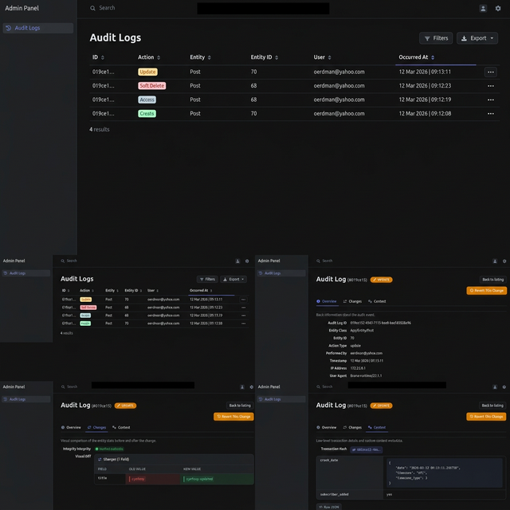
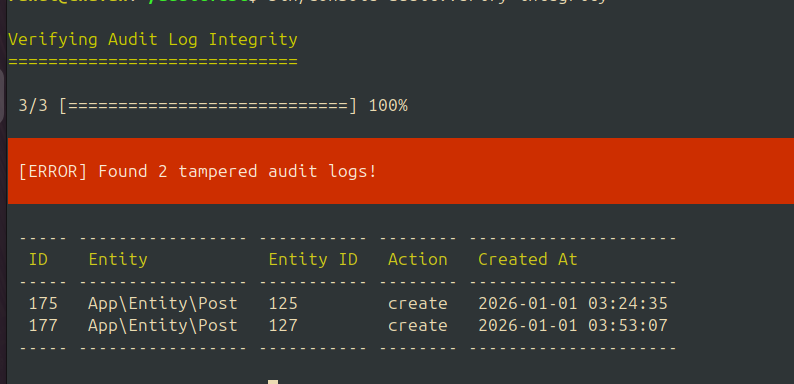

# AuditTrailBundle

[](https://github.com/rcsofttech85/AuditTrailBundle/actions/workflows/ci.yaml)
[](https://packagist.org/packages/rcsofttech/audit-trail-bundle)
[](https://packagist.org/packages/rcsofttech/audit-trail-bundle)
[](https://packagist.org/packages/rcsofttech/audit-trail-bundle)
[](https://app.codacy.com/gh/rcsofttech85/AuditTrailBundle/dashboard?utm_source=gh&utm_medium=referral&utm_content=&utm_campaign=Badge_grade)
[](https://app.codacy.com/gh/rcsofttech85/AuditTrailBundle/dashboard?utm_source=gh&utm_medium=referral&utm_content=&utm_campaign=Badge_coverage)
[](https://dashboard.stryker-mutator.io/reports/github.com/rcsofttech85/AuditTrailBundle/main)

**High-performance audit trail bundle for Symfony.**

AuditTrailBundle is a modern, lightweight bundle that automatically tracks and stores Doctrine ORM entity changes. Built for performance and compliance, it uses a **Split-Phase Architecture** by default, while still allowing stricter in-transaction delivery when your compliance requirements demand it.

---

## Why AuditTrailBundle?

Most audit bundles capture changes synchronously, which can significantly slow down your application's write performance. AuditTrailBundle solves this by separating **Capture**, **Delivery**, and phase-appropriate **Persistence** work.

### Split-Phase Architecture

```text
  Application       Doctrine ORM       AuditTrailBundle       Queue / Storage
       |                  |                    |                     |
       | flush()          |                    |                     |
       |----------------->|                    |                     |
       |                  | onFlush            |                     |
       |                  |------------------->|                     |
       |                  |                    | Compute Diffs       |
       |                  |                    | Persist ORM-safe    |
       |                  |                    | audit rows when     |
       |                  |                    | allowed in-UoW      |
       |                  |<-------------------|                     |
       |                  |                    |                     |
       |                  | Execute SQL        |                     |
       |                  | (Transaction)      |                     |
       |                  |                    |                     |
       |                  | postFlush          |                     |
       |                  |------------------->|                     |
       |                  |                    | Dispatch Audit      |
       |                  |                    | Persist deferred    |
       |                  |                    | database audits via |
       |                  |                    | direct writer       |
       |                  |                    |-------------------->|
       | flush() returns  |                    |                     |
       |<-----------------|                    |                     |
                                                                     | Async Save
```

- **Flexible delivery**: Audit capture happens during the flush. By default, dispatch is deferred until the `postFlush` boundary, and some transports can also be offloaded to Messenger workers.
- **Doctrine-safe phase handling**: The bundle does not call `flush()` from inside Doctrine `postFlush`. In-transaction ORM-safe writes stay in `onFlush`; deferred database writes use a direct writer path.
- **Data Integrity**: Cryptographic signing helps detect tampering with persisted logs and transport payloads.
- **Developer First**: Simple PHP 8 attributes, zero boilerplate.

### Key Features

- **High Performance**: Deferred-by-default audits using a **Split-Phase Architecture** (capture in `onFlush`, dispatch after `postFlush` in the default mode).
- **Multiple Transports**: Doctrine (Database), HTTP (ELK/Splunk), and Queue (RabbitMQ/Redis/Messenger).
- **Deep Collection Tracking**: Tracks Many-to-Many and One-to-Many changes with precision.
- **Sensitive Data Masking**: Native support for `#[SensitiveParameter]` and custom `#[Sensitive]` attributes.
- **Safe Revert Support**: Easily roll back entities to any point in history.
- **Access Auditing**: Track sensitive entity read operations (GET requests) with built-in request-level deduplication and optional cross-request cooldowns.
- **Conditional Auditing**: Skip logs based on runtime conditions or Expressions.
- **Rich Context**: Automatically tracks IP, User Agent, impersonation context, and custom metadata.
- **AI-Ready Extension Hooks**: Optional AI processors can add namespaced summaries, anomaly flags, or structured insights before audit signing and transport dispatch.
- **Web Profiler Integration**: Real-time audit log visibility in the Symfony debug toolbar and profiler panel.

---

## Admin UI

Native integration with **EasyAdmin** provides a built-in dashboard for browsing and reviewing audit logs.



---

## Security & Compliance

Track not just what changed, but who did it and where they were.

- **Sensitive Data Masking**: Native support for `#[SensitiveParameter]` and custom `#[Sensitive]` attributes.
- **HMAC Signatures**: Audit logs can be signed so tampering can be detected during verification.
- **Integrity Verification**: Command-line tools to audit your audit logs.



---

## Documentation

| Topic | Description |
| :--- | :--- |
| **[Installation & Setup](README.md#quick-start)** | Getting started guide. |
| **[Configuration](docs/configuration.md)** | Full configuration reference (`enabled`, `transports`, `integrity`, access auditing, collection serialization). |
| **[Upgrade v3](docs/upgrade-v3.md)** | Migration checklist for upgrading custom and standard integrations to `3.0`. |
| **[Advanced Usage](docs/advanced-usage.md)** | Attributes, Conditional Auditing, Impersonation, Custom Context. |
| **[Transports](docs/symfony-audit-transports.md)** | Doctrine, HTTP, and Queue (Messenger) transport details. |
| **[Audit Reader](docs/symfony-audit-reader.md)** | Querying audit logs programmatically. |
| **[Revert & Recovery](docs/revert-feature.md)** | Point-in-time restoration of entities. |
| **[Security & Integrity](docs/security-integrity.md)** | Data masking, cryptographic signing, and verification. |
| **[CLI Commands](docs/cli-commands.md)** | Console commands for listing, purging, and exporting logs. |
| **[Integrations](docs/integrations.md)** | EasyAdmin and Symfony Profiler support. |
| **[Serialization](docs/serialization.md)** | Cross-platform JSON format. |
| **[Failure & Transaction Safety](docs/configuration.md#transaction-safety-guide)** | Recommended settings for `defer_transport_until_commit`, fallback, and transport errors. |

---

## Quick Start

### 1. Installation

```bash
composer require rcsofttech/audit-trail-bundle
```

### 2. Database Setup (Doctrine Transport)

If you are using the **Doctrine Transport** (default), update your database schema:

```bash
php bin/console make:migration
php bin/console doctrine:migrations:migrate
```

### 3. Basic Usage

Add the `#[Auditable]` attribute to any Doctrine entity you want to track.

```php
<?php

declare(strict_types=1);

use Doctrine\ORM\Mapping as ORM;
use Rcsofttech\AuditTrailBundle\Attribute\Auditable;

#[ORM\Entity]
#[Auditable(ignoredProperties: ['internalCode'])]
class Product
{
    #[ORM\Id]
    #[ORM\GeneratedValue]
    #[ORM\Column]
    public private(set) ?int $id = null;

    #[ORM\Column]
    public private(set) string $name;
}
```

The default transport stores audit logs in the database. If you enable integrity signing, make sure `audit_trail.integrity.secret` is configured.

### 4. Requirements

- **PHP**: 8.4+
- **Symfony**: 7.4+ or 8.0+
- **Doctrine ORM**: 3.6+

### 5. Operational Defaults

If you are choosing settings for a production rollout:

- Use `defer_transport_until_commit: true` for HTTP or queue-first setups where application write latency matters most.
- HTTP and queue transports remain deferred-phase transports; setting `defer_transport_until_commit: false` does not move them into Doctrine's `onFlush` transaction window.
- Use synchronous database transport with `fail_on_transport_error: true` when compliance requires the write and audit to succeed or fail together.
- Keep `fallback_to_database: true` when you want external transport failures to still leave a local audit trail.
- Configure a PSR-6 `cache_pool` if you rely on cross-request access-audit cooldowns.

Operational notes:

- Audit query limits must be positive integers. The fluent `AuditReader`/`AuditQuery` API and repository layer now reject `0` or negative limits instead of silently accepting them.
- Cursor pagination uses audit-log UUIDs. Invalid cursors are rejected.
- EasyAdmin transaction drill-down accepts only one cursor at a time: `afterId` or `beforeId`, never both.
- When an entity changes scalar fields and Doctrine collections in the same flush, the bundle now records one merged `update` audit instead of splitting that flush into redundant update entries.
- EasyAdmin revert previews now handle UUID-backed relations and to-many collections safely, and restored collection values are shown in a readable format instead of raw Doctrine object dumps.
- Delete-driven collection audits are most reliable with bidirectional Doctrine associations. Unidirectional mappings can leave the bundle without enough reverse-relation context to infer an owner-side collection update when a related entity is deleted.

---

## Community & Support

- **Bugs & Features**: Please use the [GitHub Issue Tracker](https://github.com/rcsofttech85/AuditTrailBundle/issues).
- **Contributing**: Check out our [Contributing Guide](https://github.com/rcsofttech85/AuditTrailBundle/blob/main/CONTRIBUTING.md).

## License

MIT License.
