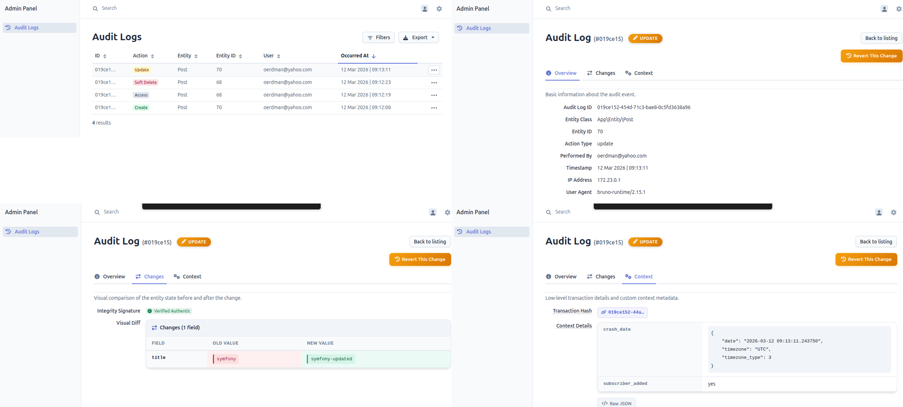

# Integrations

## EasyAdmin Integration

Add the `AuditLogCrudController` to your `DashboardController`:

```php
use Rcsofttech\AuditTrailBundle\Controller\Admin\AuditLogCrudController;

yield MenuItem::linkToCrud('Audit Logs', 'fas fa-history', AuditLog::class)
    ->setController(AuditLogCrudController::class);
```


