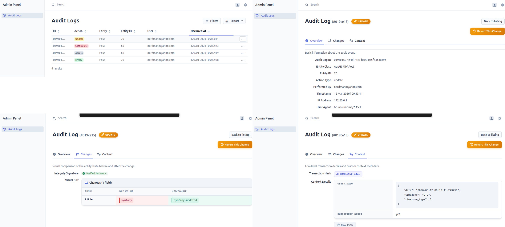

# Integrations

## EasyAdmin Integration

Add the `AuditLogCrudController` to your `DashboardController`:

```php
use Rcsofttech\AuditTrailBundle\Controller\Admin\AuditLogCrudController;

yield MenuItem::linkToCrud('Audit Logs', 'fas fa-history', AuditLog::class)
    ->setController(AuditLogCrudController::class);
```

### Publishing Assets

To ensure the custom styling for the Audit Log UI (diffs, action badges, and revert modals) loads correctly, you must install the bundle's public assets:

```bash
php bin/console assets:install
```


