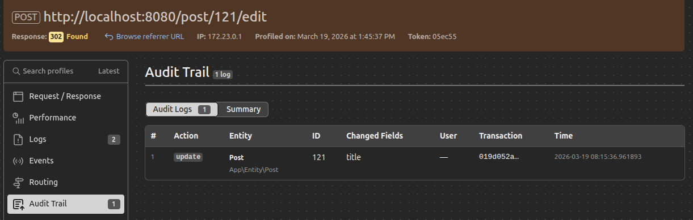

# Integrations

## EasyAdmin Integration

Add the `AuditLogCrudController` to your `DashboardController`:

```php
<?php

declare(strict_types=1);

use EasyCorp\Bundle\EasyAdminBundle\Config\MenuItem;
use Rcsofttech\AuditTrailBundle\Entity\AuditLog;
use Rcsofttech\AuditTrailBundle\Controller\Admin\AuditLogCrudController;

yield MenuItem::linkToCrud('Audit Logs', 'fas fa-history', AuditLog::class)
    ->setController(AuditLogCrudController::class);
```

### Publishing Assets

To ensure the custom styling for the Audit Log UI (diffs, action badges, and revert modals) loads correctly, you must install the bundle's public assets:

```bash
php bin/console assets:install public
```


---

## Symfony Web Profiler Integration

AuditTrailBundle integrates with the **Symfony Web Profiler** to provide real-time visibility into audit logs generated during each request — directly in the debug toolbar and profiler panel.

### Automatic Registration

This integration activates **automatically** when `WebProfilerBundle` is installed (typically in `dev` and `test` environments). No additional configuration is required.

In production, where `WebProfilerBundle` is absent, the profiler services are not registered.

### What You Get

- **Toolbar Badge**: A live count of audit logs generated during the current request.
- **Profiler Panel**: A detailed table showing every audit event with action, entity, changed fields, user, transaction hash, and timestamp.
- **Summary Tab**: An at-a-glance breakdown of audit actions (creates, updates, deletes).


